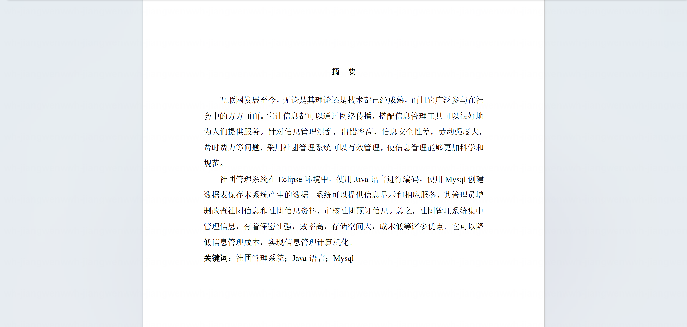
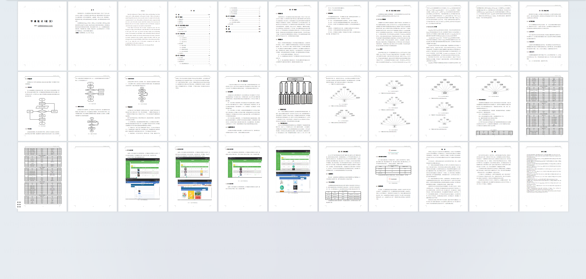
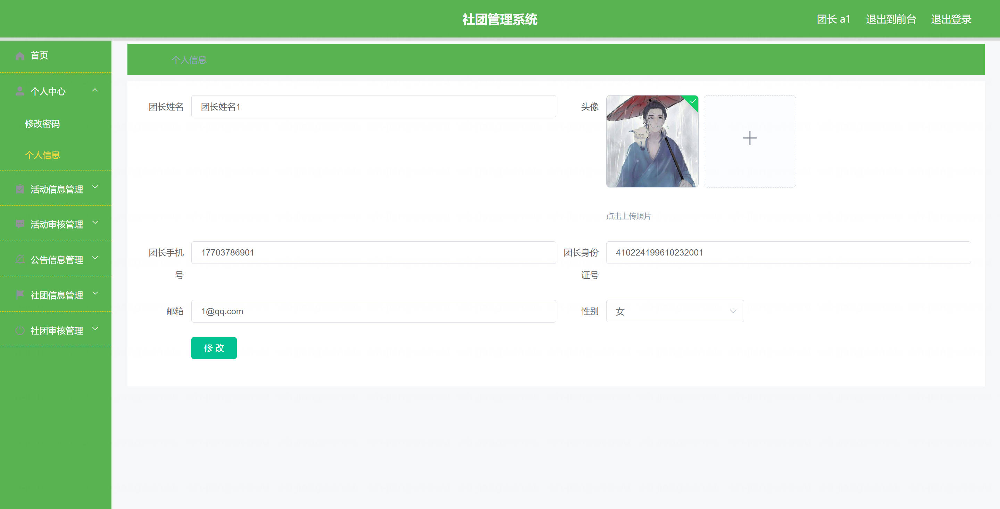
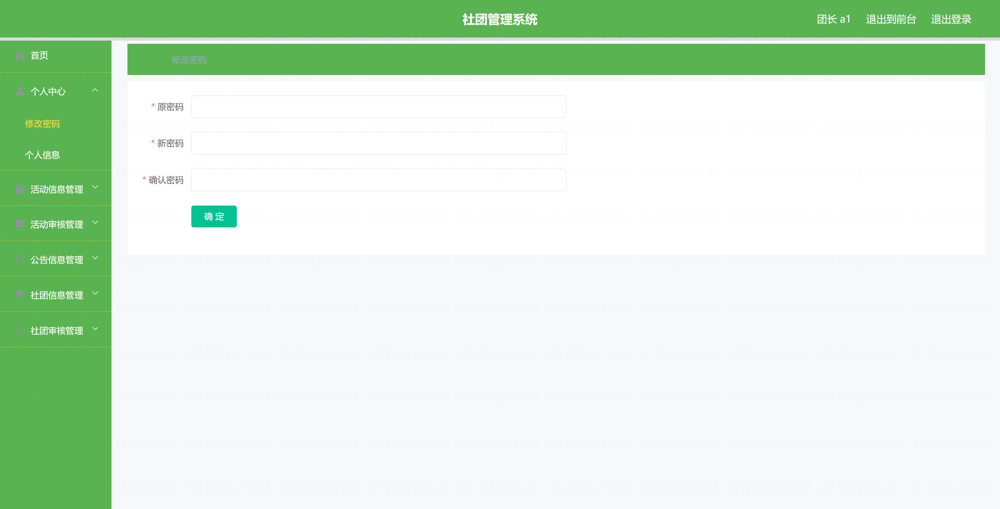
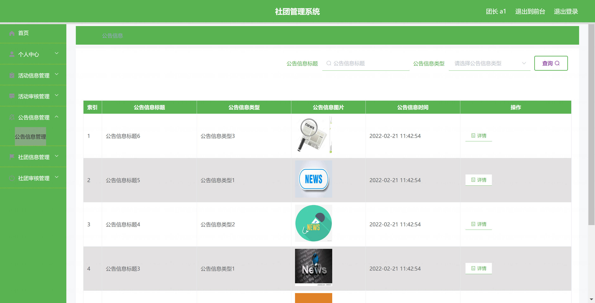
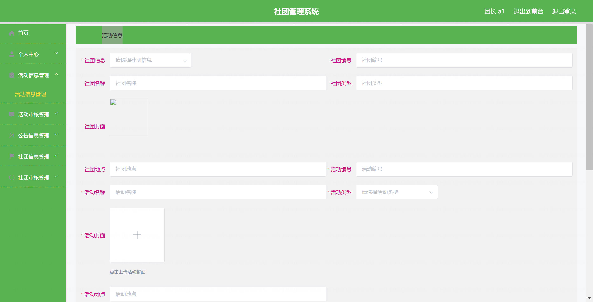
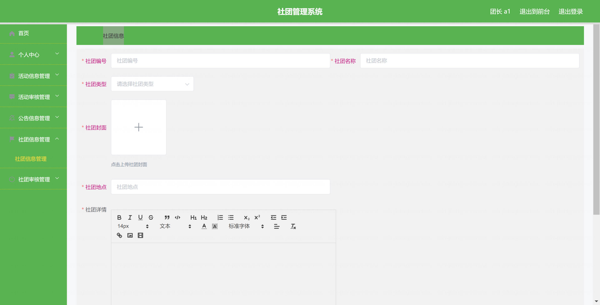
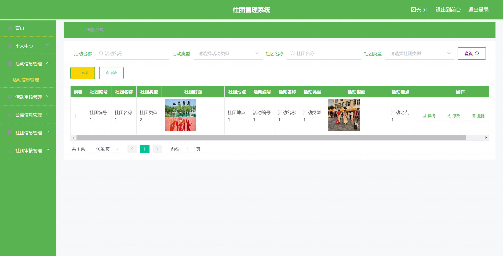
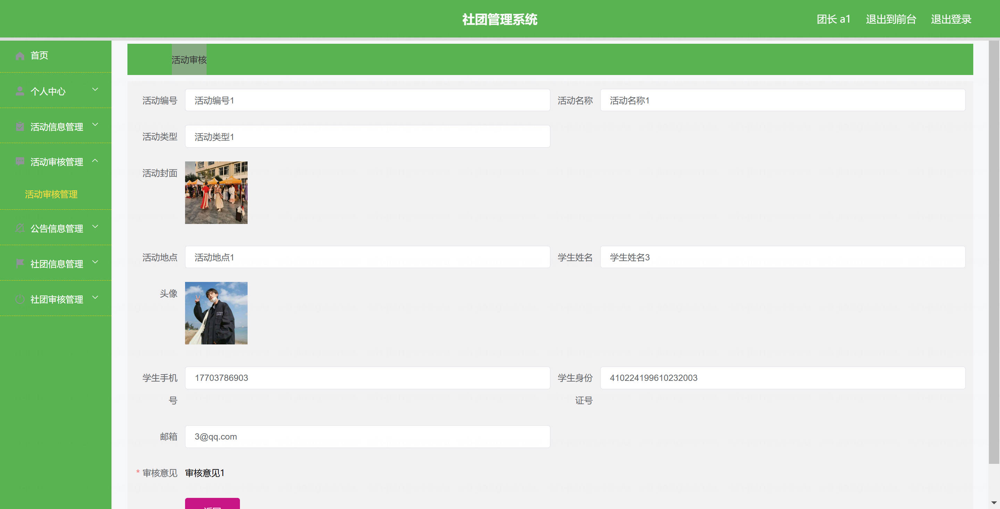
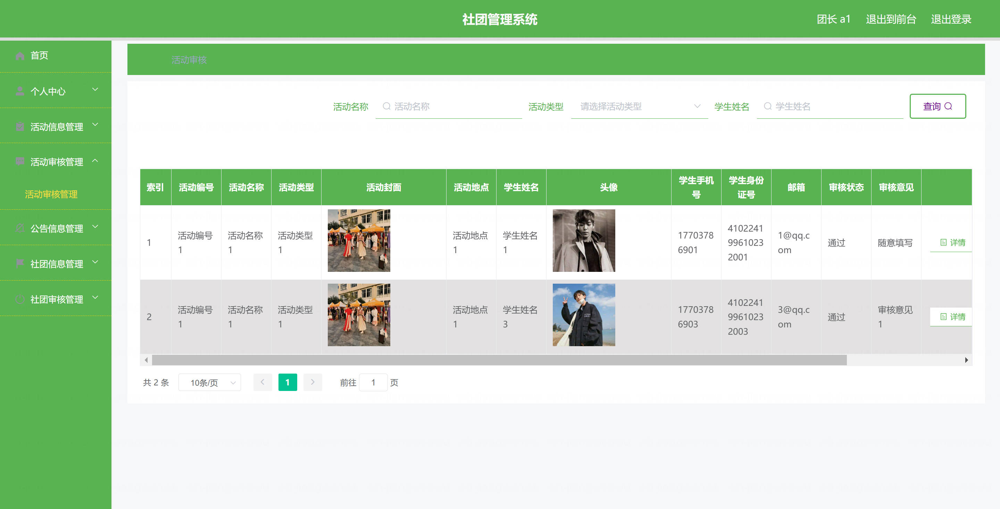

基于Springboot的社团管理系统（程序+论文）
=

### 完整代码获取地址：从戎源码网 ([https://armycodes.com/](https://armycodes.com/))
### 作者微信：19941326836  QQ：952045282 
### 承接计算机毕业设计、Java毕业设计、Python毕业设计、深度学习、机器学习
### 选题+开题报告+任务书+程序定制+安装调试+论文+答辩ppt 一条龙服务
### 所有选题地址https://github.com/nature924/allProject

一、项目介绍
---

基于SpringBoot框架的社团管理系统，系统角色为管理员、团长和学生，主要功能如下

管理员：
基本操作：登录、修改密码、获取个人信息、修改个人信息
轮播图管理：获取轮播图列表、新增轮播图、修改轮播图、删除轮播图
公告信息管理：获取公告信息列表、发布公告、查看公告详情、修改公告、删除公告
社团信息管理：筛选社团、获取社团列表、查看社团详情、新增社团、修改社团、删除社团
社团审核管理：获取社团审核列表、审批社团、查看审核记录、删除审核记录
活动信息管理：筛选活动、获取活动列表、查看活动详情、发布活动、修改活动、删除活动
活动审核管理：获取活动审核列表、审批活动、查看审核记录、删除审核记录
团长管理：筛选团长、获取团长列表、查看团长详情、新增团长、修改团长、删除团长
学生管理：筛选学生、获取学生列表、查看学生详情、新增学生、修改学生、删除学生
用户管理：筛选用户、获取用户列表、查看用户详情、新增用户、修改用户、删除用户

团长：
基本操作：登录、修改密码、获取个人信息、修改个人信息
社团信息管理：查看本团社团信息、编辑社团信息、提交社团审核、查看审核结果
活动信息管理：发布活动、获取活动列表、查看活动详情、修改活动、删除活动
活动审核管理：查看活动审核列表、查看审核记录
公告信息管理：浏览公告信息、查看公告详情

学生：
基本操作：登录、修改密码、获取个人信息、修改个人信息、注册
公告信息管理：浏览公告信息、查看公告详情
社团信息管理：浏览社团、查看社团详情
活动信息管理：浏览活动、查看活动详情

二、项目技术
---
- 编程语言：Java
- 数据库：MySQL
- 项目架构：B/S架构
- 前端技术：JSP
- 后端技术：Spring、SpringMVC、MyBatis

三、运行环境
---
- 操作系统：Windows、macOS都可以
- JDK版本：JDK1.8以上都可以
- 开发工具：IDEA、Ecplise、Myecplise都可以
- 数据库: MySQL5.7以上都可以
- Tomcat：任意版本都可以
- Maven：任意版本都可以

四、运行截图
---
### 论文截图：

### 程序截图：

